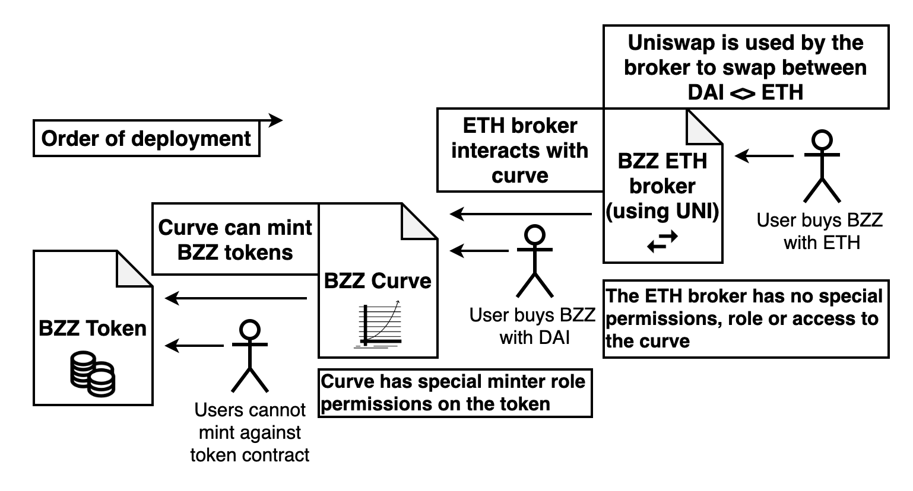

<div align="center">

 <h1>BZZ Smart Contract Ecosystem</h1>
</div>

---

# Index

#### [Repository Set Up](#repository-set-up)

#### [Testing and Coverage](#testing-and-coverage)

#### [Deployment](#deployment)

- [Testnet Deployment](#testnet-deployment)
- [Mainnet Deployment](#mainnet-deployment)

#### [System Design](#system-design)

### Additional documentation

#### [~ `README`](./README.md)
#### [> Audit Report and Info](./audit/Audit_report_and_info.md)
##### [> Final audit report](./Buzzar_final_audit_report.pdf)
#### [> Admin Permissions and Risks](./docs/admin_permissions_and_risks.md)
#### [> Token Contract](./docs/token_contract.md)
#### [> Curve Contract](./docs/curve_contract.md)
#### [> ETH Broker Contract](./docs/eth_broker_contract.md)

---

# Repository Set Up

To get the blockchain folder into a working state, you will need to install the required packages. To do so, in a terminal open in this directory, run the following:

```
yarn
```

This will install all the needed packages. This may take some time. If your build fails, please check your `node` version, for this repository it is recommended to use `10.21.0`.

Once all the required packages have been installed, build the smart contracts by running:

```
yarn build
```

This will compile the Solidity contracts using the correct version of Solidity.

# Testing and Coverage

To run the tests you will need to run a local instance of the blockchain using Ganache. While Ganache has a GUI, we recommend using the CLI tool instead. In a new terminal in this directory run the following to start a local CLI instance:

```
yarn start
```

Please ensure that you do not have the GUI running as they use the same ports.

Once the Ganache instance is up and running you can run the following command to run the tests:

```
yarn test
```

To run the coverage for the repository, you will need to end your Ganache CLI instance, as the coverage tool runs it's own instance. Once your instance has been safely exited, run the following for the coverage:

```
yarn cover
```

This will take a while to run. Please also note that `Curve.sol` does not have 100% branch coverage directly. The branch coverage is ensured through the `CurveTest.sol` where the curves internal functions are exposed for the final branch coverage. As such the `CurveTest.sol` does not have 100% coverage, but has 100% branch coverage.

# Deployment

The bonding curve has a deployment script for the following networks:

```
local (1337) (Ganache)
Rinkeby (4)
Main (1)
```

Before you are able to deploy to any of these networks, you will need to create an `.env` file in this directory. After you have created your `.env` file, you will need to copy the contents of the `.env.example` file:

```
# Deployer EOA private key (insecure)
DEPLOYER_PRIVATE_KEY_LOCAL=
DEPLOYER_PRIVATE_KEY_RINKEBY=
DEPLOYER_PRIVATE_KEY_MAINNET=

# Infura key (rinkeby + mainnet)
INFURA_API_KEY=

# BZZ bonding curve set up variables
BZZ_DEPLOYED_MAINNET=
DAI_ADDRESS_MAINNET=0x6b175474e89094c44da98b954eedeac495271d0f
OWNER_ADDRESS=

# TESTING SET UP
    # Mock DAI (for testing) set up
    COLLATERAL_TOKEN_NAME=
    COLLATERAL_TOKEN_SYMBOL=
    COLLATERAL_TOKEN_DECIMAL=18

    # BZZ token set up variables
    TOKEN_NAME=
    TOKEN_SYMBOL=
    # BZZ token has 16 decimals. DO NOT CHANGE THIS! This will break the bonding curve
    TOKEN_DECIMAL=16
    # BZZ needs this limit for the curve. DO NOT CHANGE THIS! This will break the bonding curve
    TOKEN_CAP=1250000000000000000000000

    # Testing address
    ADDRESS_OF_TESTER=
```

The `.env` file is separated into logical sections to make deployment easier. The first section contains the private keys for deployment on the various networks. Please ensure that the private key that is being used has ETH on the respective network. It is recommended to have at least 0.5 ETH for deployment, more if you intend to deploy multiple times for testing.

**NOTE: Do not change the decimal or token cap of the BZZ token.** These variables are required as is in order for the bonding curve math to work. Changing these variables may result in unexpected behaviors.

The deployment script itself has been split into deployment for testing and deployment for Mainnet. This has been done to reduce friction for testing. Below both deployment scripts shall be explained and walked through.

## Testnet Deployment

The testing portion of the deployment script will run when deploying to local or Rinkeby.

The test deployment script will deploy the BZZ token, Bonding curve as well as a Mock DAI. The script will also mint the test user address some Mock DAI. This speeds up the testing process.

Please ensure that you have filled in all the following values from the `.env.example` before attempting to run the script:

```
# Deployer EOA private key (insecure)
DEPLOYER_PRIVATE_KEY_LOCAL=
DEPLOYER_PRIVATE_KEY_RINKEBY=

# Infura key (rinkeby + mainnet)
INFURA_API_KEY=

# TESTING SET UP
    # Mock DAI (for testing) set up
    COLLATERAL_TOKEN_NAME=
    COLLATERAL_TOKEN_SYMBOL=
    COLLATERAL_TOKEN_DECIMAL=18

    # BZZ token set up variables
    TOKEN_NAME=
    TOKEN_SYMBOL=
    # BZZ token has 16 decimals. DO NOT CHANGE THIS! This will break the bonding curve
    TOKEN_DECIMAL=16
    # BZZ needs this limit for the curve. DO NOT CHANGE THIS! This will break the bonding curve
    TOKEN_CAP=1250000000000000000000000

    # Testing address
    ADDRESS_OF_TESTER=
```

Please note that private keys need to start with `0x` and will fail if they have not been prefixed.

When deploying locally please ensure your Ganache CLI is running.
To deploy locally run the following:

```
yarn deploy:local
```

When deploying to Rinkeby please ensure that the private key being used has Rinkeby ETH. [You can get Rinkeby ETH from the facet.](https://faucet.rinkeby.io/) To deploy on Rinkeby run the following:

```
yarn deploy:rinkeby
```

## Mainnet Deployment

The mainnet deployment script will **only deploy the bonding curve**. You will need to enter the address of the deployed BZZ token into the `.env`. Please note that deploying the curve will not initialise it, this will need to be done manually either through [Remix](http://remix.ethereum.org/) or [Etherscan](https://etherscan.io/).

Before running the deployment script, please ensure the following fields have been filled out in the `.env`:

```
# Deployer EOA private key (insecure)
DEPLOYER_PRIVATE_KEY_MAINNET=

# Infura key (rinkeby + mainnet)
INFURA_API_KEY=

# BZZ bonding curve set up variables
BZZ_DEPLOYED_MAINNET=
DAI_ADDRESS_MAINNET=0x6b175474e89094c44da98b954eedeac495271d0f
OWNER_ADDRESS=
```

Ensure the provided private key has sufficient ETH (at least 0.5) before attempting to run the script, and that the address of the deployer is not the same as the address of the owner. The address of DAI on the mainnet has been entered for convenience, but please double check this address before deploying. The address of the owner should preferably be that of a multisig wallet.

Once all the values have been filled in the `.env`, run the following to deploy to mainnet:

```
yarn deploy:mainnet
```

Once deployment is complete you will have the address of the deployed bonding curve. To initialise the curve please follow the below steps (they will also be printed in the terminal during deployment):

1. Add the BZZ Curve as a minter on the BZZ token
2. Pre-minted at least the minimum number of tokens on the BZZ token (62500000 1e16)
3. Ensure the calling address has sufficient collateral to initialise (call `requiredCollateral` on the BZZ curve to get the required collateral amount)
4. Approve the BZZ curve address as a spender of the required collateral amount
5. Call the init function

After these steps have been completed the bonding curve will be operational and able to mint and burn tokens in exchange for DAI. Without following these steps the bonding curve will not function.

# System Design

This smart contract ecosystem has been designed to reduce the security risk and interdependency of the contracts. As such, the BZZ token is separate from the BZZ bonding curve. This allows the curve to be shut down independently from the token should the need arise. The BZZ ETH broker is separate from the BZZ curve and interacts like a normal user with the curve.

<div align="center">

</div>

Should the curve need to be shut down, it will remove itself as minter on the BZZ token. This will leave the BZZ token without a minter, thus capping the supply at the time of shut down at the current supply.

The BZZ broker will check the liveness status of the curve, and will disable minting and burning accordingly.

For more information on each of these contracts please see the specific documentation:

#### [> Token Contract](./docs/token_contract.md)
#### [> Curve Contract](./docs/curve_contract.md)
#### [> ETH Broker Contract](./docs/eth_broker_contract.md)

To understand the risks associated with these elevated permissions see:

#### [> Admin Permissions and Risks](./docs/admin_permissions_and_risks.md)

For the audit, see:

#### [> Audit Report and Info](./audit/Audit_report_and_info.md)

Or jump directly to the final audit report:

#### [> Final audit report](./Buzzar_final_audit_report.pdf)

---

### License

This library is distributed under the BSD-style license found in the LICENSE file.
