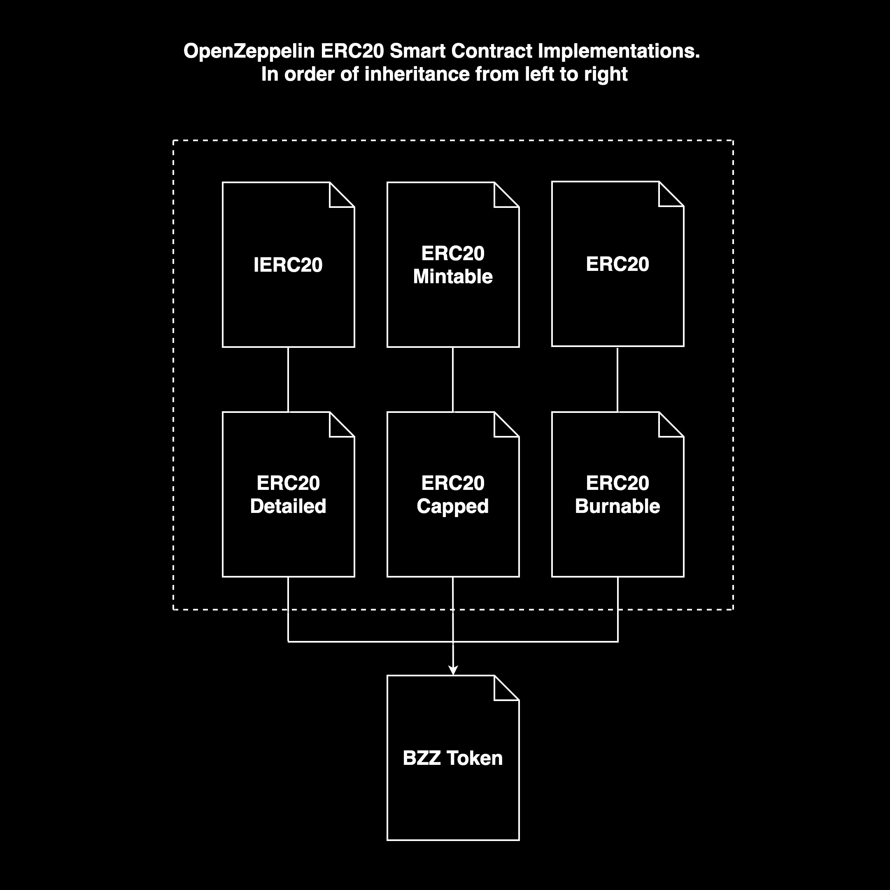

<div align="center">

 <h1>BZZ Token Contract</h1>
</div>

---

# Index

#### [BZZ Token Contract](#bzz-token-contract)

- [Interface](#interface)
- [Inheritance](#inheritance)
    - [ERC20Detailed](#erc20detailed)
    - [ERC20Capped](#erc20capped)
    - [ERC20Burnable](#erc20burnable)
- [Inheritance Visuals](#inheritance-visuals)
    - [Simplified](#simplified)
    - [Complete](#complete)

### Additional documentation

#### [< `README`](../README.md)
#### [~ Token Contract](./token_contract.md)
#### [> Admin Permissions and Risks](./admin_permissions_and_risks.md)
#### [> Curve Contract](./curve_contract.md)
#### [> ETH Broker Contract](./eth_broker_contract.md)

---

# BZZ Token Contract

The Token is designed to inherit the following implementations from the [OpenZeppelin library (V2)](https://docs.openzeppelin.com/contracts/2.x/api/token/erc20#ERC20):
1. `ERC20` [(docs)](https://docs.openzeppelin.com/contracts/2.x/api/token/erc20#ERC20)
    The ERC20 standard as implemented in the OpenZeppelin library.
2. `ERC20Detailed` [(docs)](https://docs.openzeppelin.com/contracts/2.x/api/token/erc20#ERC20Detailed)
    This extension allows for the storing of a name, symbol and explicit decimal. 
3. `ERC20Capped` [(docs)](https://docs.openzeppelin.com/contracts/2.x/api/token/erc20#ERC20Capped)
    This extension allows for an explicit cap on the number of tokens that can ever be in existence simultaneously .
4. `ERC20Mintable` [(docs)](https://docs.openzeppelin.com/contracts/2.x/api/token/erc20#ERC20Mintable)
    This extension allows users with the `Mintable` role to mint tokens freely. This is included to allow for future compatibility with a bonding curve.
5. `ERC20Burnable`[(docs)](https://docs.openzeppelin.com/contracts/2.x/api/token/erc20#ERC20Burnable)
    This allows a user to burn tokens, as well as allows approved addresses to burn tokens on the users behalf. This again is included for future compatibility. **Note that this functionally has been modified in order to have the `burn` and `burnFrom` functionally protected by the `minterRole`.**

## Interface

The full interface of publicly callable functions for the Token contract can be found [here](../contracts/I_Token.sol).

## Inheritance 

The `Token` contract inherits the above contracts as follows:
```
contract Token is ERC20Detailed, ERC20Capped, ERC20Burnable {
```

As you can see, it seems as if all the contracts are not there. But when we dig a bit deeper, we can see all the contracts are in fact, present. 

### `ERC20Detailed`
Detailed imports the IERC20 interface:
```
contract ERC20Detailed is IERC20 {
```

### `ERC20Capped`
Capped is Mintable, meaning that by inheriting capped we are inheriting mintable. 
```
contract ERC20Capped is ERC20Mintable {
```

### `ERC20Burnable`
Burnable inherits from ERC20, so we fully implement the interface imported by Detailed, meaning the contract is not abstract and all ERC20 functionality is present. 
```
contract ERC20Burnable is Context, ERC20 {
```

The modifications the the burnable functionality look as follows:

```
    /**
     * @dev Destroys `amount` tokens from the caller.
     *
     * See {ERC20-_burn}.
     */
    function burn(uint256 amount) public onlyMinter {
        _burn(_msgSender(), amount);
    }

    /**
     * @dev See {ERC20-_burnFrom}.
     */
    function burnFrom(address account, uint256 amount) public onlyMinter {
        _burnFrom(account, amount);
    }
```

The `onlyMinter` modifier has been added to both functions. This is done to protect users against accidentally burning their tokens. For more information see [admin permissions and risks: MinterRole](./admin_permissions_and_risks.md#minterrole)

### Inheritance Visuals

Below we can see the inheritance (simply) laid out in order. Here we are only looking at the first level of inheritance, i.e we are not looking at what the inherited contracts inherit. 

#### Simplified 
This simple diagram shows how all the required extensions are inherited. 



#### Complete

For the full inheritance structure, please see the below diagram


